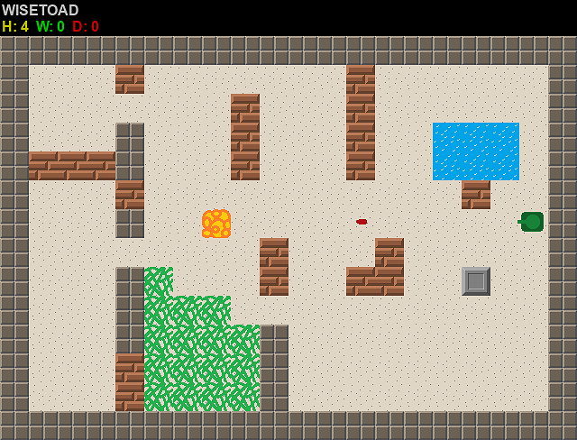

The simple multiplayer 2D tanks game in Python, developed with my kids.  

#### FEATURES
- gameplay resembles famous NES game Battle City
- allow multiple players to fight each other via network  
  tested on local home network, but theoretically may work via Internet (didn't tested, though)
- game is compatible with [RetroPy](https://github.com/WiseToad/RetroPy) libretro core

#### COMPATIBILITY
- developed with Python 3.11.2  
  It's a pity that Debian Bookworm and Raspi OS are delaying to get to Py 12+ so my generics are not so nice in the code as I would wish

#### REQUIREMENTS
Python modules:
- pygame
- configobj

To meet these requirements do either `pip install ...` (Windows and so) or `apt install python3-...` (Ubuntu and so)

#### CONFIGURE
See tanks.conf
        
#### USAGE
- cd src/
- run `server.py` once on some machine reachable for all clients via network
- run `tanks.py` for each client that desires to play

#### TODO
- make tanks of different colors for different players, display tank color next to player name
- fix config file loading bug when app failed when no config file or no param found
- add map cycling on timeout (now there is only one map get "refreshed")
- allow two players to play on same client (needed especially for libretro cores)
- design more maps
