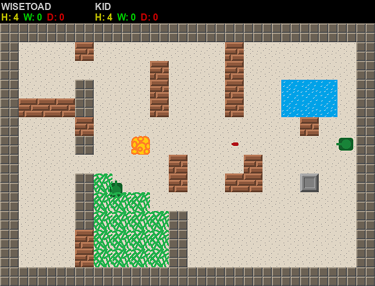

The simple multiplayer 2D tanks game in Python, developed with my kids.  

#### COMPATIBILITY
- developed with Python 3.11.2  
  It's a pity that Debian Bookworm and Raspi OS are delaying to get to Py 12+ so my generics are not so nice in the code as I would wish

#### REQUIREMENTS
- pygame

#### CONFIGURE
See src/tanks.yaml
        
#### USAGE
- cd src
- run server.py
- run tanks.py for each client that desires to play

#### TODO
- tanks of different colors for different players
- add automatic map cycling on timeout
